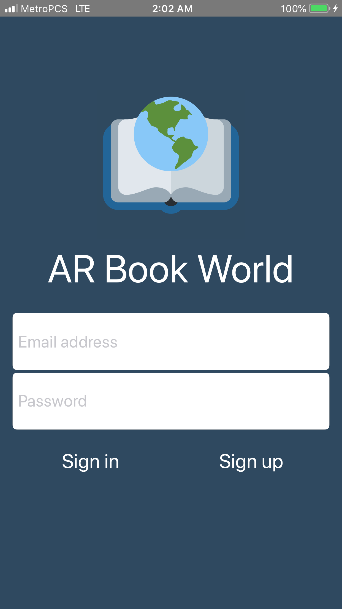
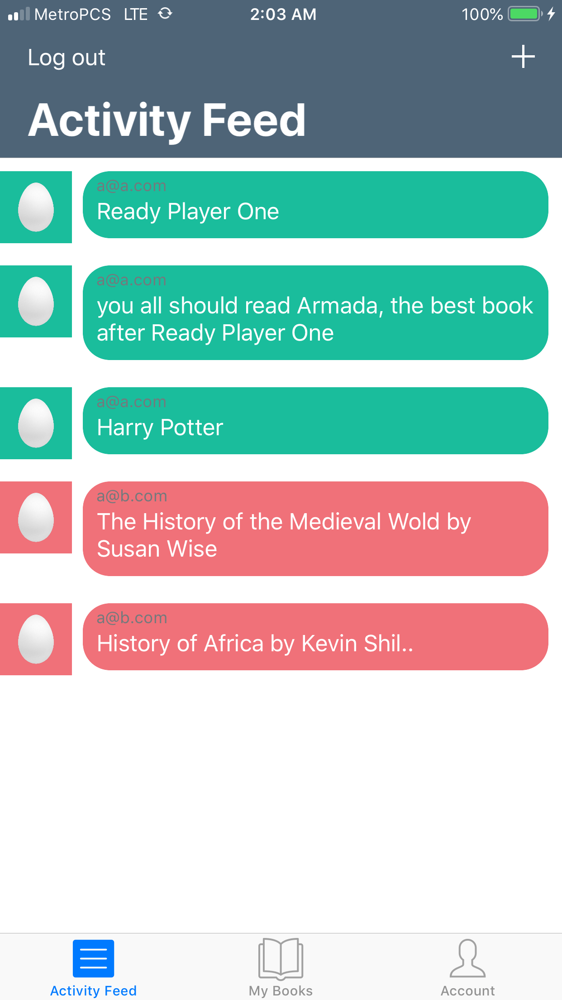
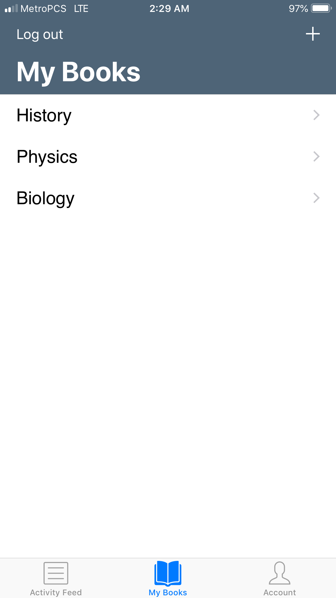
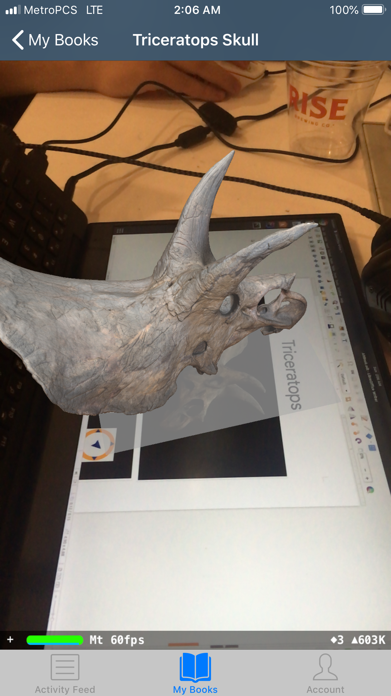
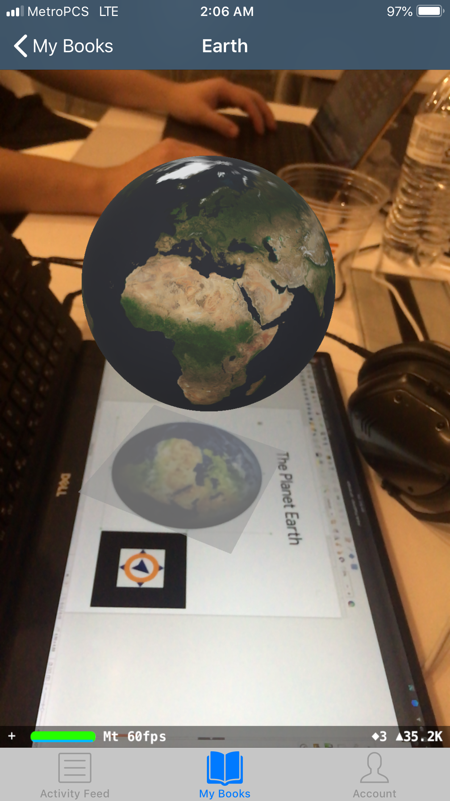
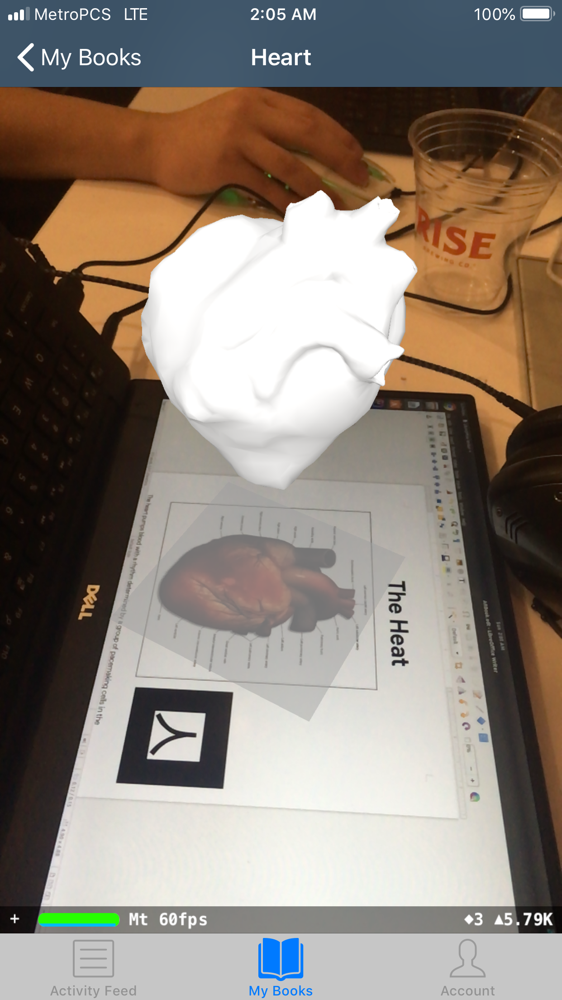
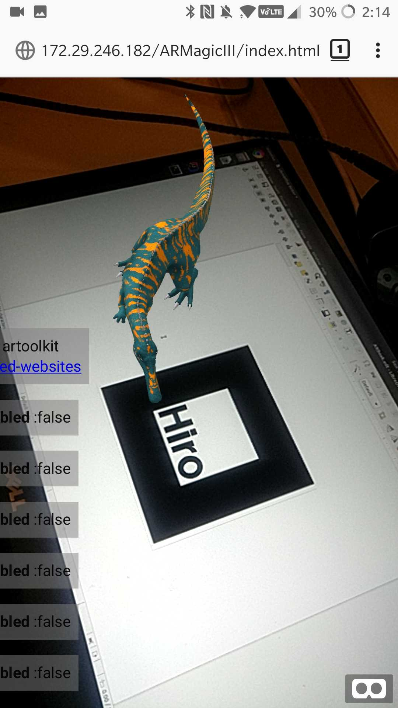
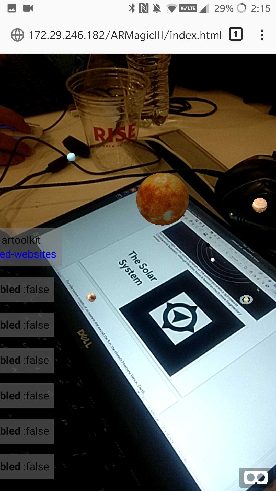
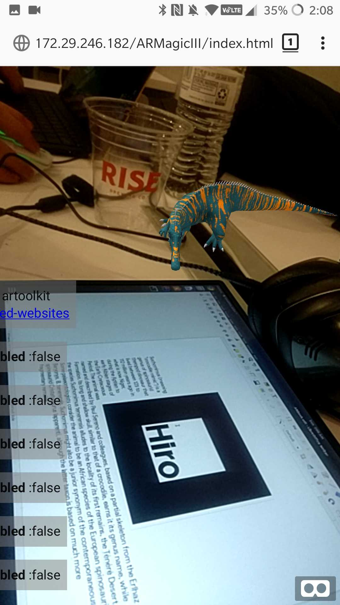
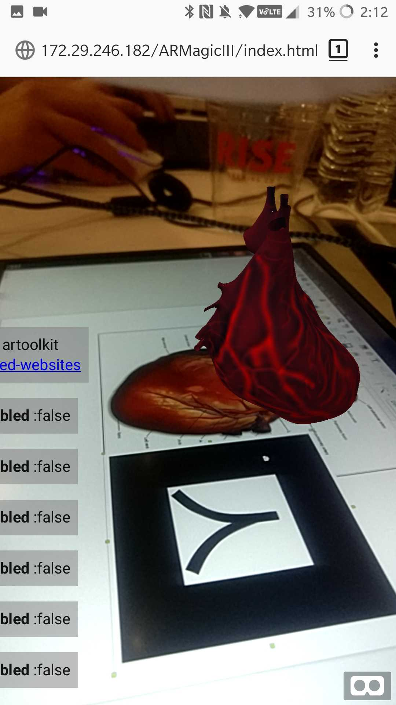

#  AR Book World. 
## #HackNYU2019
### Track: Education

Make books more interactive which creates experiential learning and more engagement within classroom.

## IOS App:
Welcome Page                 |Share your favourite books with the world | View 3D models of images on your books
:---------------------------:|:------------------------------:|:------------------------------:
      |   | 

1                            |  2                             | 3
:---------------------------:|:------------------------------:|:------------------------------:
      |           | 

## Web App: Runs on everywhere, you only ned a browser
Welcome Page                 |Share your favourite books with the world | View 3D models of images on your books
:---------------------------:|:------------------------------:|:------------------------------:
      |   | 

1                            |  2                             | 3
:---------------------------:|:------------------------------:|:------------------------------:
      |           | 
